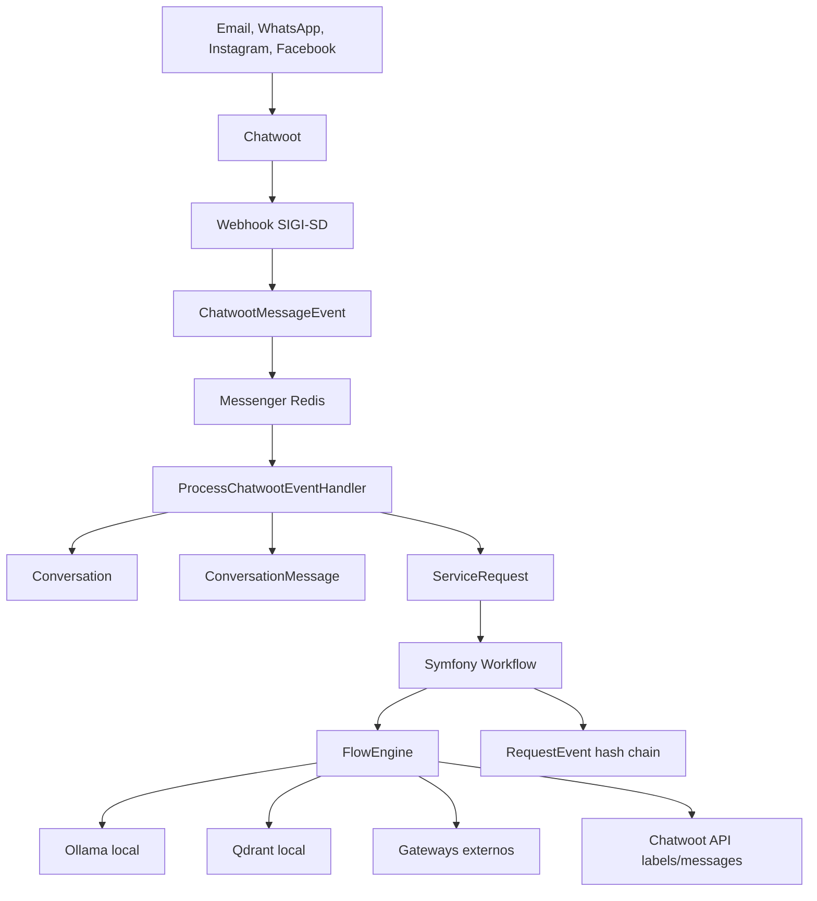

# Conversation Workflow Plan

## Escopo desta etapa

Esta etapa entrega a analise tecnica e o plano incremental para evoluir o SIGI-SD para um motor local de fluxos de atendimento com Symfony Workflow, Messenger, Lock, PostgreSQL, Redis, Chatwoot self-hosted, Ollama e Qdrant.

As mudancas estruturais ja foram iniciadas: a Etapa 2 criou as entidades/migrations base e a Etapa 3 adicionou o state machine `service_request` com sincronizacao inicial a partir do fluxo Chatwoot existente.

## Estado atual do repositorio

### Estrutura geral

O repositorio esta organizado como uma plataforma local Docker:

- `apps/backend-symfony`: Admin Hub Symfony e backend principal.
- `docker-compose.yml`: Postgres com pgvector, Redis, Traefik, Symfony, Chatwoot, Chatwoot worker, Botpress, Ollama, Qdrant, Portainer e pgAdmin.
- `docs`: documentacao de arquitetura, integracoes, IA, operacao, Docker, LGPD e modelos legados.
- `scripts`: automacoes operacionais do Chatwoot, incluindo registro do Assistente SIGI.

O README confirma o principio atual: Chatwoot e a interface operacional, SIGI-SD e a camada institucional de protocolos, cadastros, historico e integracoes.

### Documentacao existente relevante

- `docs/integracoes/chatwoot-sigi.md` ja define que o SIGI-SD nao deve recriar a inbox omnichannel e deve aproveitar o Chatwoot.
- `docs/arquitetura/modulos.md` lista modulos esperados como Attendance, Protocol, Channel, AI, KnowledgeBase, Integration, Audit, LGPD e Scheduling.
- `docs/ia/ia-embarcada.md`, `docs/ia/ollama.md`, `docs/ia/qdrant.md` e `docs/ia/rag-local.md` ja apontam Ollama e Qdrant como componentes locais.
- `docs/arquitetura/decisoes-arquiteturais.md` possui a ADR-004 antiga, que diz que o SIGI-SD nao deve se transformar em motor de workflow. Esta decisao diverge do novo objetivo e deve ser substituida por uma ADR nova antes da implementacao estrutural.

### Integracao Chatwoot atual

A integracao atual esta concentrada em:

- `src/Controller/Admin/Integration/Chatwoot/ChatwootWebhookController.php`
- `src/Service/Integration/Chatwoot/ChatwootWebhookService.php`
- `src/Service/Integration/Chatwoot/ChatwootEventProcessorService.php`
- `src/Service/Integration/Chatwoot/ChatwootConversationSyncService.php`
- `src/Service/Integration/Chatwoot/ChatwootApiClient.php`
- `src/Service/Integration/Chatwoot/ChatwootContactSyncService.php`
- `src/Service/Integration/Chatwoot/ChatwootConversationNormalizer.php`
- `src/Service/Integration/Chatwoot/ChatwootChannelMapper.php`

O webhook atual:

1. recebe `POST /admin/integrations/chatwoot/webhook/{accountId}`;
2. valida JSON;
3. le `X-SIGI-CHATWOOT-SECRET` ou `X-Chatwoot-Webhook-Secret`;
4. valida a conta Chatwoot ativa;
5. extrai tipo de evento, conversa e mensagem;
6. calcula hash do payload;
7. verifica duplicidade em `chatwoot_message_events`;
8. persiste `ChatwootMessageEvent`;
9. processa o evento de forma sincrona;
10. sincroniza conversa e protocolo no mesmo request HTTP.

Esse fluxo deve ser preservado como nucleo funcional, mas o processamento deve migrar para Messenger de forma incremental.

### Protocolo atual

O protocolo atual esta em `AttendanceProtocol`.

Campos relevantes ja existentes:

- `protocolCode`
- `sequenceScope`
- `sequenceDate`
- `sequenceNumber`
- `chatwootConversationId`
- `chatwootContactId`
- `contactName`
- `contactHandle`
- `sourceChannel`
- `subject`
- `status`
- `labels`
- `responsibleTeam`
- `responsibleAgent`
- `priority`
- flags de nota/mensagem de protocolo enviada
- vinculo opcional com `Person`
- timestamps de criacao, atualizacao e fechamento

O gerador atual, `ProtocolNumberGenerator`, usa `ProtocolSettings` e `AttendanceProtocolRepository::getNextSequenceNumber()` para gerar o formato `YYYYMMDD000001`.

Limite importante: hoje existe `uniq_attendance_chatwoot_conversation`, que amarra uma conversa a um unico protocolo. O novo modelo exige separar `Conversation` de `ServiceRequest`, permitindo varias solicitacoes por conversa. Isso deve ser migrado com compatibilidade, sem remover `AttendanceProtocol` abruptamente.

### Entidades e modelos ja existentes

Modelos relacionados que devem ser reaproveitados:

- `Person`, `PersonContact`, `PersonContactInteraction`
- `Organization`, `OrganizationContact`, `OrganizationContactInteraction`
- `AttendanceProtocol`
- `ProtocolSettings`
- `ChatwootAccount`
- `ChatwootMessageEvent`
- `ContactType`, `ContactStatus`, `ContactIssueType`
- `InteractionStatus`, `InteractionThread`
- `User`, `Role`

Nao foram encontradas entidades dedicadas para:

- `Conversation`
- `ServiceRequest`
- `ConversationMessage`
- `RequestEvent`
- `ExternalIntegrationLog`
- `AiExecutionLog`
- definicoes versionadas de fluxo
- locks persistidos
- jobs Messenger do fluxo

### IA local atual

Existe `LocalAiAssistantService`, usado para sugestao de resposta no painel lateral do Chatwoot. Ele chama Ollama diretamente via HTTP em `/api/generate`, usando:

- `OLLAMA_BASE_URL`
- `OLLAMA_MODEL`

Esse servico e util como prova operacional, mas nao atende ainda ao contrato alvo:

- falta `LocalAiClientInterface`;
- falta DTO estruturado;
- falta validacao JSON;
- falta log de execucao de IA;
- falta controle explicito de autorizacao antes de responder;
- falta separacao entre sugestao para humano e resposta automatica.

### Qdrant atual

Qdrant existe no Docker e em documentacao, mas nao foi encontrado adapter Symfony equivalente a `KnowledgeBaseInterface` ou `QdrantKnowledgeBase`.

### Redis, Messenger e Lock

Redis existe no Docker e em `.env.example` como `REDIS_URL`.

Nao foi encontrada configuracao Symfony Messenger em `config/packages/messenger.yaml`, nem dependencia `symfony/messenger` no `composer.json`.

Nao foi encontrada dependencia `symfony/lock` nem configuracao `LOCK_DSN`.

Portanto, Redis ja esta disponivel como infraestrutura, mas ainda nao esta ligado ao backend Symfony para filas e locks do motor de atendimento.

### Docker

O `docker-compose.yml` ja possui:

- `postgres` com imagem `pgvector/pgvector:pg16`
- `redis`
- `traefik`
- `portainer`
- `pgadmin`
- `symfony-admin`
- `chatwoot`
- `chatwoot-worker`
- `botpress`
- `ollama`
- `qdrant`

Pontos de atencao:

- Chatwoot e SIGI compartilham a mesma infraestrutura PostgreSQL, mas usam bancos separados (`sigi_sd` e `chatwoot_production`).
- Ollama e Qdrant estao atras do Traefik com hosts locais. Para o requisito "rede interna Docker", a implementacao do backend deve usar URLs internas (`http://ollama:11434`, `http://qdrant:6333`) e evitar exposicao publica em ambientes nao locais.
- Ainda nao existe servico separado `sigi-worker` ou `sigi-scheduler`.
- Botpress ainda existe no Docker e na documentacao. O novo fluxo local deve descontinuar Botpress como controlador do atendimento automatizado, sem remover o servico nesta etapa.

### Premissa operacional: WSL e servicos de banco

As validacoes que dependem de PostgreSQL, Redis, Chatwoot, Ollama ou Qdrant devem ser executadas pelo ambiente WSL com Docker ativo. O PHP local do Windows pode ser usado para checks leves, mas nao deve ser considerado a referencia para testes que exigem servicos de infraestrutura.

Fluxo recomendado antes de validar banco, migrations, schema, Messenger ou integracoes:

```bash
cd /mnt/c/Users/Public/sigi-sd
make up-db
make up-admin
```

Para validacoes dentro do container Symfony:

```bash
make shell-admin
php bin/console doctrine:schema:validate
php bin/console doctrine:migrations:status
php bin/console cache:clear
```

Quando a etapa envolver Chatwoot, subir tambem:

```bash
make up-chat
```

Quando a etapa envolver IA local e base vetorial, subir tambem:

```bash
make up-ia
```

Essa premissa tambem vale para workers futuros do Symfony Messenger: o Redis utilizado deve ser o servico `redis` da rede Docker `sigi-network`.

Tambem e uma premissa operacional usar URLs com nomes estaveis em vez de IPs e portas diretas. Dentro da rede Docker, as integracoes devem usar nomes de servico como `postgres`, `redis`, `symfony-admin`, `chatwoot`, `ollama` e `qdrant`. No navegador e em configuracoes publicas locais, devem ser usados os hosts do Traefik, como `admin.sigi.localhost`, `chat.sigi.localhost`, `ia.sigi.localhost`, `qdrant.sigi.localhost`, `portainer.sigi.localhost` e `pgadmin.sigi.localhost`.

Excecoes aceitaveis devem ficar restritas a mapeamentos de infraestrutura documentados, como a porta do dashboard do Traefik em `localhost:18080` ou healthchecks tecnicos especificos. Codigo de aplicacao, webhooks e variaveis de ambiente nao devem depender de IPs locais volateis.

### Testes automatizados

Existem testes Symfony para areas gerais:

- comandos de usuario;
- controllers basicos;
- blog/admin;
- Twig;
- validators;
- transformador de tags.

Nao foram encontrados testes especificos para:

- webhook Chatwoot;
- idempotencia de evento;
- geracao de protocolo;
- sincronizacao de conversa;
- bloqueio de IA quando humano assume;
- retomada por label;
- workflow;
- Messenger;
- Lock;
- cadeia de auditoria;
- Ollama;
- Qdrant;
- fluxo farmaceutico.

## Divergencias e decisoes necessarias

### ADR-004 antiga

A ADR-004 diz que o SIGI-SD nao deve ter modulo de workflow. O novo objetivo exige Symfony Workflow como controlador oficial do ciclo de vida da solicitacao.

Decisao proposta:

- criar nova ADR substituindo a ADR-004;
- delimitar que o SIGI-SD tera workflow transacional para atendimento e protocolo, mas nao sera um orquestrador generico de processos administrativos amplos;
- manter o Chatwoot como camada operacional de conversa.

### `AttendanceProtocol` versus `ServiceRequest`

O novo modelo pede `ServiceRequest`. O sistema atual tem `AttendanceProtocol` como protocolo e espelho de conversa.

Decisao proposta:

- nao remover `AttendanceProtocol` na primeira migracao;
- criar `Conversation` como espelho oficial do dialogo Chatwoot;
- criar `ServiceRequest` como evolucao do protocolo/solicitacao;
- migrar gradualmente a semantica de protocolo para `ServiceRequest`;
- manter views e dashboard antigos lendo `AttendanceProtocol` ate a nova timeline estar pronta;
- avaliar se `AttendanceProtocol` vira alias legado, tabela historica ou aggregate simplificado apos a Etapa 10.

### Processamento sincrono do webhook

O webhook atual funciona, mas processa no request HTTP.

Decisao proposta:

- manter validacao e persistencia imediata no controller/service;
- responder `202 Accepted` apos gravar evento e despachar mensagem;
- mover `ChatwootEventProcessorService::process()` para handler Messenger;
- preservar idempotencia antes do dispatch.

### Labels

A documentacao antiga usa algumas labels com `:`. O pedido atual exige hifen.

Decisao proposta:

- usar labels com hifen em novos fluxos;
- preservar labels antigas recebidas do Chatwoot;
- mapear as labels SIGI reservadas em um servico dedicado.

## Arquitetura alvo incremental



### Camadas sugeridas

Manter o padrao atual e introduzir os novos nomes sem quebrar controllers existentes:

- `src/Domain/Conversation`
- `src/Domain/ServiceRequest`
- `src/Application/Conversation`
- `src/Application/ServiceRequest`
- `src/Infrastructure/Chatwoot`
- `src/Infrastructure/Ai`
- `src/Infrastructure/VectorStore`
- `src/Infrastructure/Integration`
- `src/Infrastructure/Audit`

Como o projeto atual ainda usa `src/Service` e `src/Entity`, a transicao deve ser gradual:

- novas entidades Doctrine em `src/Entity`;
- contratos de dominio/aplicacao nos novos namespaces;
- adapters infra nos novos namespaces;
- services legados usados como facades ou delegados ate a migracao.

## Modelo de dominio proposto

### Conversation

Espelho local da conversa Chatwoot. Deve conter:

- conta, inbox e conversation id do Chatwoot;
- canal;
- contato local ou externo;
- controlador atual (`ai`, `human`, `system`, `waiting`);
- flag `automationEnabled`;
- agente/time atribuidos;
- timestamps de entrada, saida e fechamento.

Indice unico sugerido:

- `chatwootAccountId + chatwootConversationId`

### ServiceRequest

Solicitacao administrativa e protocolo. Uma conversa pode ter varias solicitacoes.

Campos chave:

- protocolo;
- `conversationId`;
- `workflowKey`;
- `workflowVersion`;
- `currentState`;
- `currentStep`;
- `serviceType`;
- `intent`;
- `confidence`;
- `collectedData`;
- `context`;
- status, prioridade, setor e responsaveis.

### ConversationMessage

Historico do que foi dito, separado do evento bruto do webhook.

Chave de idempotencia sugerida:

- `conversationId + chatwootMessageId`

### RequestEvent

Trilha oficial do que o sistema fez.

Deve ser append-only por regra de aplicacao e conter:

- transicao;
- estado anterior e novo;
- ator;
- motivo;
- resultado;
- metadata higienizada;
- `previousEventHash`;
- `eventHash`.

### ExternalIntegrationLog

Registro tecnico de consultas a estoque, agenda, cadastro cidadao, validacao de receita e notificacoes.

Nao deve persistir segredo, token, documento pessoal ou payload sensivel em texto aberto.

### AiExecutionLog

Registro estruturado de uso do Ollama:

- modelo;
- prompt key/version;
- operacao;
- hash de entrada;
- resultado estruturado;
- confianca;
- fontes consultadas;
- duracao;
- sucesso/erro.

Nao registrar raciocinio interno do modelo.

## Symfony Workflow

Criar `config/packages/workflow.yaml` com state machine `sigi_service_request`.

Estados minimos:

- `new`
- `protocol_created`
- `identifying_request`
- `classifying`
- `collecting_data`
- `waiting_user`
- `processing`
- `checking_external_system`
- `waiting_human`
- `human_service`
- `resuming_automation`
- `scheduled`
- `completed`
- `cancelled`
- `closed`
- `error`

Guards iniciais:

- bloquear automacao quando `Conversation.currentController = human`;
- bloquear `resume_ai` sem autorizacao;
- bloquear agendamento sem regras validadas;
- bloquear conclusao com pendencias obrigatorias;
- bloquear consulta externa sem identificadores minimos;
- encaminhar baixa confianca para humano.

## Messenger, Redis e Lock

Adicionar dependencias somente na etapa de implementacao:

- `symfony/messenger`
- `symfony/redis-messenger` se necessario para transporte Redis no Symfony 8;
- `symfony/lock`

Configurar:

- transporte Redis principal;
- fila de falhas;
- retry com backoff;
- workers Docker `sigi-worker`;
- scheduler ou comando para tarefas recorrentes quando necessario.

Mensagens iniciais:

- `ProcessChatwootEventMessage`
- `ProcessIncomingMessageMessage`
- `ClassifyIntentMessage`
- `ExtractStructuredDataMessage`
- `GenerateAiResponseMessage`
- `SearchKnowledgeBaseMessage`
- `ProcessAttachmentMessage`
- `SummarizeHumanConversationMessage`
- `CallExternalSystemMessage`
- `SendChatwootMessage`
- `ApplyChatwootLabelsMessage`
- `CreateAuditEventMessage`

Locks:

- `chatwoot-conversation-{accountId}-{conversationId}`
- `service-request-{requestId}`

Quando o lock nao for adquirido, o handler deve lancar excecao recuperavel para retry do Messenger.

## Fluxo inicial: assistencia farmaceutica

Criar fluxo versionado `pharmaceutical_medicine_request` v1.

Etapas:

1. identificar medicamento;
2. coletar dosagem;
3. registrar anexo/receita quando existir;
4. extrair dados preliminares;
5. validar regras;
6. consultar estoque via gateway;
7. consultar agenda via gateway;
8. reservar temporariamente;
9. oferecer horarios;
10. confirmar escolha;
11. revalidar estoque e horario;
12. confirmar agendamento;
13. enviar codigo de retirada;
14. concluir.

Gateways fake iniciais:

- `FakeMedicineInventoryGateway`
- `FakePickupScheduleGateway`
- `FakePrescriptionValidationGateway`

Regra central: a IA nunca informa disponibilidade, previsao ou agenda sem resposta do gateway oficial/fake.

## Plano de implementacao por etapas

### Etapa 2: Entidades, migrations e auditoria

Criar:

- `Conversation`
- `ServiceRequest`
- `ConversationMessage`
- `RequestEvent`
- `ExternalIntegrationLog`
- `AiExecutionLog`

Criar:

- `AuditHashChainService`
- comando `sigi:audit:verify`

Migrar sem quebrar:

- manter `AttendanceProtocol`;
- criar vinculos opcionais entre `AttendanceProtocol`, `Conversation` e `ServiceRequest` se necessario;
- preservar telas atuais.

### Etapa 3: Workflow e guards

Status atual: iniciado.

Entregue:

- dependencia `symfony/workflow` adicionada ao backend Symfony;
- `config/packages/workflow.yaml` com state machine `service_request`;
- guard de automacao para impedir transicao automatica quando a conversa esta sob controle humano;
- `ConversationWorkflowSyncService` para sincronizar `Conversation`, `ServiceRequest`, `ConversationMessage` e `RequestEvent` a partir do payload Chatwoot normalizado;
- integracao do bridge no `ChatwootConversationSyncService`, preservando `AttendanceProtocol` como compatibilidade legada;
- validação no WSL/container com `lint:container`, `doctrine:schema:validate --skip-sync` e `debug:config framework workflows`.

Resolvido nesta etapa:

- testes automatizados de transicao valida/invalida;
- teste de guard bloqueando automacao quando humano controla a conversa;
- regra explicita de baixa confianca levando para humano;
- `ServiceRequestTransitionService` como aplicador publico de transicoes para futuros comandos/admin/API.

Pendente para evolucao posterior:

- expor as transicoes em UI/API administrativa;
- enriquecer `RequestEvent` com eventos explicitos para cada transicao manual.

### Etapa 4: Messenger, Redis, Lock e idempotencia

Status atual: implementado em ambiente WSL/Docker.

Entregue:

- mensagens e handlers;
- `messenger.yaml`;
- `lock.yaml` ou configuracao equivalente;
- `sigi-worker` no Docker;
- comandos Make para workers;
- migracao do webhook para `202 Accepted`.

### Etapa 5: Integracao Chatwoot

Adaptar:

- `ChatwootWebhookService` para apenas validar, deduplicar, persistir e despachar;
- `ChatwootEventProcessorService` para ser usado por handler;
- normalizacao de eventos relevantes;
- bloqueio de loops de mensagens enviadas pelo proprio SIGI.

### Etapa 6: Controle humano e retomada da IA

Implementar:

- deteccao de assignee humano;
- `currentController = human`;
- `automationEnabled = false`;
- labels `humano-ativo`, `ia-pausada`;
- label `sigi-retomar-ia`;
- resumo das mensagens humanas;
- retomada sem reiniciar fluxo.

### Etapa 7: Ollama estruturado

Criar:

- `LocalAiClientInterface`
- `OllamaClient`
- DTOs por operacao;
- validacao de JSON;
- fallback para humano em baixa confianca;
- `AiExecutionLog`.

### Etapa 8: Qdrant

Criar:

- `KnowledgeBaseInterface`
- `QdrantKnowledgeBase`
- DTOs de busca;
- registro de fontes usadas no `AiExecutionLog`.

### Etapa 9: Assistencia farmaceutica

Criar:

- flow definition v1;
- flow engine;
- gateways fake;
- testes de estoque disponivel/indisponivel;
- testes de agendamento com revalidacao.

### Etapa 10: Timeline e auditoria no painel

Adicionar abas em detalhe de solicitacao/protocolo:

- Resumo;
- Conversa;
- Linha do tempo;
- Integracoes;
- Auditoria tecnica.

Controlar acesso tecnico com voters.

### Etapa 11: Testes, documentacao e validacao Docker

Completar:

- testes unitarios, integracao e funcionais;
- docs de operacao dos workers;
- docs Ollama/Qdrant;
- docs LGPD;
- validacao Docker local.

## Arquivos previstos

### Novos arquivos provaveis

- `apps/backend-symfony/config/packages/workflow.yaml`
- `apps/backend-symfony/config/packages/messenger.yaml`
- `apps/backend-symfony/config/packages/lock.yaml`
- `apps/backend-symfony/src/Entity/Conversation.php`
- `apps/backend-symfony/src/Entity/ServiceRequest.php`
- `apps/backend-symfony/src/Entity/ConversationMessage.php`
- `apps/backend-symfony/src/Entity/RequestEvent.php`
- `apps/backend-symfony/src/Entity/ExternalIntegrationLog.php`
- `apps/backend-symfony/src/Entity/AiExecutionLog.php`
- `apps/backend-symfony/src/Message/*`
- `apps/backend-symfony/src/MessageHandler/*`
- `apps/backend-symfony/src/Domain/ServiceRequest/*`
- `apps/backend-symfony/src/Application/ServiceRequest/*`
- `apps/backend-symfony/src/Infrastructure/Ai/OllamaClient.php`
- `apps/backend-symfony/src/Infrastructure/VectorStore/QdrantKnowledgeBase.php`
- `apps/backend-symfony/src/Infrastructure/Integration/Pharmacy/*`
- `apps/backend-symfony/src/Security/Voter/ServiceRequestVoter.php`
- `apps/backend-symfony/src/Command/VerifyAuditCommand.php`
- `docs/architecture/conversation-workflow.md`
- `docs/architecture/audit-model.md`
- `docs/architecture/local-ai.md`
- `docs/integrations/chatwoot.md`
- `docs/integrations/pharmacy.md`
- `docs/operations/workers.md`
- `docs/operations/ollama.md`
- `docs/operations/qdrant.md`
- `docs/security/lgpd.md`
- `docs/testing/conversation-workflow.md`

### Arquivos existentes que devem ser alterados gradualmente

- `apps/backend-symfony/composer.json`
- `apps/backend-symfony/config/bundles.php`
- `apps/backend-symfony/config/services.yaml`
- `apps/backend-symfony/src/Controller/Admin/Integration/Chatwoot/ChatwootWebhookController.php`
- `apps/backend-symfony/src/Service/Integration/Chatwoot/ChatwootWebhookService.php`
- `apps/backend-symfony/src/Service/Integration/Chatwoot/ChatwootEventProcessorService.php`
- `apps/backend-symfony/src/Service/Integration/Chatwoot/ChatwootConversationSyncService.php`
- `apps/backend-symfony/src/Service/Integration/Chatwoot/ChatwootApiClient.php`
- `apps/backend-symfony/src/Entity/AttendanceProtocol.php`
- `apps/backend-symfony/src/Repository/AttendanceProtocolRepository.php`
- `docker-compose.yml`
- `Makefile`
- `.env.example`
- `README.md`
- `docs/arquitetura/decisoes-arquiteturais.md`

## Variaveis de ambiente propostas

Adicionar ou normalizar:

```env
MESSENGER_TRANSPORT_DSN=redis://redis:6379/messages
LOCK_DSN=redis://redis:6379

OLLAMA_BASE_URL=http://ollama:11434
OLLAMA_CHAT_MODEL=llama3.1
OLLAMA_EMBEDDING_MODEL=
OLLAMA_TIMEOUT_SECONDS=60

QDRANT_URL=http://qdrant:6333
QDRANT_COLLECTION=sigi_knowledge

SIGI_AI_MIN_CONFIDENCE=0.75
SIGI_MESSAGE_AGGREGATION_WINDOW_SECONDS=3
SIGI_AUTOMATION_ENABLED=true
```

Manter `OLLAMA_MODEL` temporariamente como alias legado para nao quebrar o assistente existente.

## Testes minimos por etapa

### Etapa 2

- entidade `Conversation` persiste e localiza por Chatwoot ID;
- `ServiceRequest` gera protocolo sem duplicar;
- `RequestEvent` calcula hash encadeado;
- comando de auditoria detecta alteracao.

### Etapa 3

- transicao valida;
- transicao invalida;
- guard bloqueia IA quando humano controla conversa;
- baixa confianca leva para humano.

### Etapa 4

- webhook retorna rapido;
- mensagem Messenger processa evento;
- duplicidade nao processa duas vezes;
- lock impede processamento concorrente.

### Etapa 5

- `message_created` recebido;
- mensagem do proprio SIGI e ignorada;
- labels sao aplicadas com hifen;
- erro da API Chatwoot e registrado.

### Etapa 6

- assignee humano pausa automacao;
- label `sigi-retomar-ia` retoma automacao;
- contexto humano e resumido;
- perguntas ja respondidas nao sao repetidas.

### Etapa 7 e 8

- timeout do Ollama;
- JSON invalido do Ollama;
- baixa confianca;
- erro do Qdrant;
- fontes consultadas registradas.

### Etapa 9

- estoque disponivel;
- estoque indisponivel;
- reserva temporaria;
- agendamento;
- revalidacao antes da confirmacao;
- gateway externo com erro.

## Validacoes a executar ao final das etapas de codigo

Quando houver codigo implementado, executar dentro de `apps/backend-symfony` ou via container:

```bash
composer validate
php bin/console lint:yaml config
php bin/console lint:container
php bin/console doctrine:schema:validate
php bin/console cache:clear
php bin/phpunit
vendor/bin/phpstan
vendor/bin/php-cs-fixer fix --dry-run --diff
```

Executar `npm test`, `npm run build` ou equivalentes apenas se o projeto passar a declarar esses scripts.

## Riscos

- Migrar de uma conversa para um protocolo unico para uma conversa com varias solicitacoes exige cuidado com dashboard e dados existentes.
- `ProtocolNumberGenerator::getNextSequenceNumber()` pode sofrer corrida em processamento concorrente; a etapa de Lock ou uma estrategia transacional/constraint deve cobrir isso.
- A migracao para Messenger muda a semantica do webhook de processamento imediato para processamento assicrono; telas de evento precisam expor estado pendente.
- Tokens de Chatwoot hoje ficam em campo comum da entidade; a evolucao deve proteger ou criptografar esse dado.
- Ollama e Qdrant estao acessiveis por Traefik local; producao deve restringir exposicao.
- Botpress ainda existe como servico; a documentacao deve explicar que ele e legado para esse novo fluxo.
- Payload bruto do Chatwoot pode conter dados pessoais; acesso e retencao precisam ser revistos.

## Pendencias antes da Etapa 2

1. Criar ADR nova substituindo a ADR-004.
2. Confirmar estrategia de compatibilidade entre `AttendanceProtocol` e `ServiceRequest`.
3. Definir se os novos namespaces `Domain/Application/Infrastructure` serao adotados imediatamente ou por facade gradual.
4. Confirmar politica de retencao de `ChatwootMessageEvent.rawPayload`.
5. Confirmar perfis de seguranca para auditoria tecnica e anexos sensiveis.
6. Definir modelo inicial de fake de estoque e agenda para assistencia farmaceutica.

