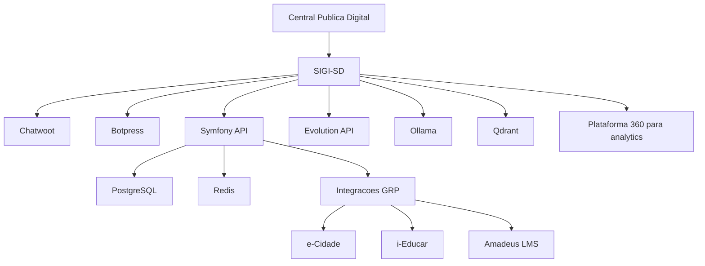

# Visao geral da arquitetura

O SIGI-SD e a plataforma tecnologica que apoia a Central Publica Digital. Sua responsabilidade e registrar, organizar e automatizar interacoes entre cidadaos, atendentes, agentes digitais, orgaos publicos, cooperativas, empresas e sistemas integrados.

## Separacao conceitual

Central Publica Digital:

- Conceito e servico publico.
- Operacao institucional.
- Ponto de contato com cidadaos e organizacoes.

SIGI-SD:

- Plataforma tecnologica de interacoes.
- Atendimento multicanal e CRM operacional.
- Chatbot, IA conversacional e integracoes.
- Protocolos, ouvidoria, agendamentos e notificacoes.

Cooperativa de Atendimento:

- Operacao humana.
- Atendentes, supervisores, qualidade e SLA.

Plataforma 360:

- BI, analytics, dashboards e indicadores.
- IA analitica e observabilidade estrategica.

GRPs:

- e-Cidade, i-Educar, Amadeus LMS e sistemas legados.
- Fontes transacionais acessadas por conectores e adaptadores.

## Diagrama

