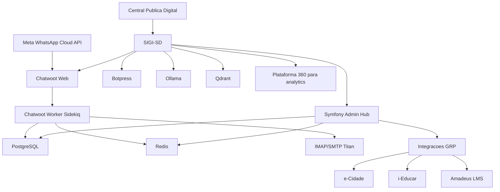

# Visao geral da arquitetura

O SIGI-SD e a plataforma tecnologica que apoia a Central Publica Digital. Sua responsabilidade e registrar, organizar e automatizar interacoes entre cidadaos, atendentes, agentes digitais, orgaos publicos, cooperativas, empresas e sistemas integrados.

## Separacao conceitual

Central Publica Digital:

- Conceito e servico publico.
- Operacao institucional.
- Ponto de contato com cidadaos e organizacoes.

SIGI-SD:

- Plataforma tecnologica de interacoes.
- Atendimento multicanal e CRM operacional.
- Chatbot, IA conversacional e integracoes.
- Protocolos, ouvidoria, agendamentos e notificacoes.

Cooperativa de Atendimento:

- Operacao humana.
- Atendentes, supervisores, qualidade e SLA.

Plataforma 360:

- BI, analytics, dashboards e indicadores.
- IA analitica e observabilidade estrategica.

GRPs:

- e-Cidade, i-Educar, Amadeus LMS e sistemas legados.
- Fontes transacionais acessadas por conectores e adaptadores.

## Diagrama

## Chatwoot na arquitetura operacional

O WhatsApp produtivo entra no SIGI-SD pela integracao oficial da Meta Cloud API configurada no Chatwoot. O Chatwoot envia eventos ao Symfony, que gera/atualiza protocolos e responde ao cidadao com o numero do protocolo pelo mesmo canal.

## Admin Hub Symfony

O Symfony e o hub administrativo do SIGI-SD e responde em `http://admin.sigi.localhost`. Ele concentra a administracao da plataforma, os cadastros internos e os pontos de integracao com aplicacoes como Chatwoot, Botpress e servicos de IA.

O Admin Hub usa o banco legado `sigi_sd`, preservando a continuidade do sistema Symfony que ja existia.

O Chatwoot e dividido em dois processos no ambiente Docker:

- `chatwoot`: aplicacao web Rails/Puma, interface de atendimento e configuracoes.
- `chatwoot-worker`: Sidekiq, filas, jobs agendados, recebimento por IMAP, auto-respostas e tarefas em background.

O recebimento de e-mails por IMAP nao acontece apenas com o processo web. A caixa pode estar configurada corretamente em `imap.titan.email:993` com SSL/TLS e ainda assim nao gerar conversas se o worker nao estiver em execucao.
