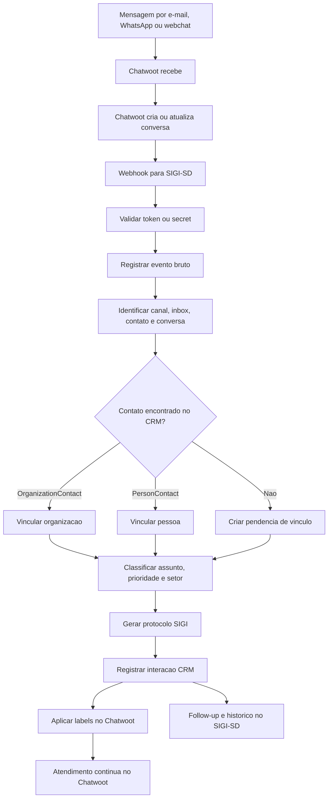

# Modulo de Integracao Chatwoot x SIGI-SD

## Objetivo

Este documento orienta a implementacao real do modulo de integracao entre Chatwoot e SIGI-SD.

O objetivo nao e recriar uma inbox omnichannel dentro do SIGI-SD. O Chatwoot continua sendo a camada operacional de atendimento multicanal. O SIGI-SD atua como camada institucional de inteligencia, CRM, classificacao, governanca, protocolo, rastreabilidade e follow-up.

## Decisao arquitetural

Chatwoot:

- Caixa de entrada omnichannel.
- Atendimento humano.
- Conversas.
- Canais.
- Times.
- Atribuicao de atendentes.
- Respostas manuais.
- Respostas rapidas.
- Operacao diaria do atendimento.

SIGI-SD:

- Inteligencia institucional.
- Cadastro de organizacoes.
- Cadastro de pessoas.
- Contatos institucionais.
- Contatos pessoais.
- Vinculos pessoa x organizacao.
- Historico estrategico de interacoes.
- Protocolo institucional.
- Classificacao de assuntos.
- Sugestao de setor.
- Follow-up.
- Rastreabilidade.
- Governanca.
- Preparacao para IA, agents e skills.

O SIGI-SD nao substitui o Chatwoot. O Chatwoot nao substitui o SIGI-SD. Ambos devem atuar de forma integrada.

## Stack considerada

- Backend: Symfony.
- Templates: Twig.
- ORM: Doctrine.
- Banco de dados: MySQL, conforme stack indicada para este modulo.
- Area administrativa: `/admin`.
- Codigo: ingles.
- Interface: portugues do Brasil.
- Arquitetura em camadas:
  - Presentation Layer.
  - Application Layer.
  - Domain Layer.
  - Infrastructure Layer.

Observacao de implementacao: o ambiente Docker atual do projeto tambem usa PostgreSQL para os servicos de infraestrutura. Se este modulo for implementado no banco atual do container, adaptar tipos Doctrine e migrations sem alterar a decisao funcional da integracao.

## Operacao Docker do Chatwoot

No ambiente local, o Chatwoot roda em dois containers:

- `sigi-chatwoot`: processo web Rails/Puma.
- `sigi-chatwoot-worker`: processo Sidekiq.

O worker e necessario para:

- buscar mensagens por IMAP;
- processar filas do Chatwoot;
- executar jobs agendados;
- disparar auto-respostas;
- processar broadcasts/eventos em background.

Para e-mail Titan, a configuracao recomendada e:

```text
Incoming server: imap.titan.email
Port: 993
Encryption method: SSL/TLS
Outgoing server: smtp.titan.email
Port: 465
Encryption method: SSL/TLS
Username: endereco completo do e-mail
```

Comandos uteis:

```bash
docker compose ps chatwoot chatwoot-worker
docker compose logs -f chatwoot chatwoot-worker
docker exec -it sigi-chatwoot bundle exec rails c
```

Teste manual de IMAP para a inbox `1`:

```bash
docker exec -it sigi-chatwoot bundle exec rails runner "Inboxes::FetchImapEmailsJob.new.perform(Inbox.find(1).channel, 24)"
```

Se o teste manual cria conversas, mas novos e-mails nao chegam automaticamente, verificar se `chatwoot-worker` esta `Up` e se o log contem `trigger_imap_email_inboxes_job`.

## Modelo CRM existente

O SIGI-SD ja possui o nucleo CRM baseado em:

```text
Organization
  -> OrganizationContact
  -> OrganizationContactInteraction

Person
  -> PersonContact
  -> PersonContactInteraction

Person
  -> PersonOrganization
  -> PersonOrganizationRole
  -> Organization
```

A integracao com Chatwoot deve aproveitar esse modelo e evitar duplicar dados operacionais. Conversas, mensagens e contatos espelhados do Chatwoot devem existir para rastreabilidade e classificacao, nao para substituir o modelo principal do SIGI-SD.

## Fluxo geral

1. Um cidadao, gestor, parceiro ou instituicao envia mensagem por e-mail, WhatsApp ou webchat.
2. O Chatwoot recebe a mensagem.
3. O Chatwoot cria ou atualiza uma conversa.
4. O Chatwoot envia webhook para o SIGI-SD.
5. O SIGI-SD valida assinatura ou token do webhook.
6. O SIGI-SD registra o evento bruto.
7. O SIGI-SD identifica canal, inbox, contato, conversa e mensagem.
8. O SIGI-SD tenta localizar `OrganizationContact` ou `PersonContact` correspondente.
9. Se encontrar, vincula automaticamente.
10. Se nao encontrar, cria pendencia de vinculo.
11. O SIGI-SD classifica assunto, prioridade e setor.
12. O SIGI-SD gera protocolo institucional.
13. O SIGI-SD registra uma interacao CRM estrategica.
14. O SIGI-SD devolve labels/tags para o Chatwoot.
15. O atendimento humano continua no Chatwoot.
16. O SIGI-SD acompanha follow-up e historico institucional.



## Entidades Doctrine

### ChatwootAccount

Representa uma instalacao ou conta do Chatwoot integrada ao SIGI-SD.

Campos:

- `id`: identificador interno.
- `name`: nome da integracao.
- `baseUrl`: URL base do Chatwoot.
- `apiTokenEncrypted`: token de API protegido ou criptografado.
- `webhookSecret`: segredo para validacao do webhook.
- `isActive`: indica se a integracao esta ativa.
- `createdAt`: data de criacao.
- `updatedAt`: data de atualizacao.

Relacionamentos:

- Possui varias `ChatwootInbox`.
- Pode estar vinculada a uma `Organization` principal.

Regras:

- `baseUrl` deve ser unica por conta ativa.
- `apiTokenEncrypted` nunca deve ser exibido em tela apos salvo.
- Contas inativas nao recebem processamento de webhook.

### ChatwootInbox

Representa uma inbox/canal do Chatwoot.

Campos:

- `id`.
- `chatwootAccount`.
- `externalInboxId`.
- `name`.
- `channelType`.
- `email`.
- `phoneNumber`.
- `isActive`.
- `createdAt`.
- `updatedAt`.

Valores sugeridos para `channelType`:

- `email`.
- `whatsapp`.
- `website`.
- `api`.
- `instagram`.
- `messenger`.

Regras:

- A combinacao `chatwootAccount` + `externalInboxId` deve ser unica.
- Inboxes removidas no Chatwoot devem ser marcadas como inativas, nao apagadas imediatamente.

### ChatwootContact

Representa o contato externo vindo do Chatwoot.

Campos:

- `id`.
- `chatwootAccount`.
- `externalContactId`.
- `name`.
- `email`.
- `phoneNumber`.
- `identifier`.
- `sourceId`.
- `rawPayload`.
- `person`.
- `organizationContact`.
- `personContact`.
- `createdAt`.
- `updatedAt`.

Regras:

- Nao duplicar `Person` automaticamente sem validacao.
- Criar pendencia quando nao houver certeza.
- Permitir vinculo manual posterior.
- A combinacao `chatwootAccount` + `externalContactId` deve ser unica.

### ChatwootConversation

Representa uma conversa do Chatwoot espelhada no SIGI-SD.

Campos:

- `id`.
- `chatwootAccount`.
- `inbox`.
- `externalConversationId`.
- `externalContactId`.
- `status`.
- `assigneeName`.
- `teamName`.
- `sourceChannel`.
- `subject`.
- `lastMessageAt`.
- `sigiProtocol`.
- `organization`.
- `person`.
- `organizationContact`.
- `personContact`.
- `createdAt`.
- `updatedAt`.

Regras:

- Uma conversa pode estar vinculada a uma organizacao.
- Uma conversa pode estar vinculada a uma pessoa.
- Uma conversa pode gerar interacao institucional ou pessoal.
- `sigiProtocol` deve ser unico quando gerado.
- A combinacao `chatwootAccount` + `externalConversationId` deve ser unica.

### ChatwootMessageEvent

Representa eventos recebidos via webhook.

Campos:

- `id`.
- `chatwootAccount`.
- `eventType`.
- `externalConversationId`.
- `externalMessageId`.
- `payloadHash`.
- `rawPayload`.
- `processedAt`.
- `processingStatus`.
- `errorMessage`.
- `createdAt`.

Status:

- `received`.
- `processing`.
- `processed`.
- `ignored`.
- `failed`.

Regras:

- Garantir idempotencia usando `externalMessageId`, `eventType` e `payloadHash`.
- Nunca processar duas vezes o mesmo evento.
- Payload bruto deve ser acessivel apenas a perfis tecnicos autorizados.

### ChatwootConversationLink

Representa vinculo estrategico entre conversa do Chatwoot e entidades do SIGI-SD.

Campos:

- `id`.
- `conversation`.
- `organization`.
- `person`.
- `organizationContact`.
- `personContact`.
- `linkType`.
- `confidenceScore`.
- `linkedBy`.
- `linkedAt`.
- `notes`.

Tipos de vinculo:

- `automatic`.
- `manual`.
- `suggested`.
- `rejected`.

Regras:

- Vinculos automaticos exigem score minimo configuravel.
- Vinculos rejeitados devem preservar historico para auditoria.

### ChatwootClassification

Representa a classificacao feita pelo SIGI-SD.

Campos:

- `id`.
- `conversation`.
- `category`.
- `priority`.
- `suggestedDepartment`.
- `sentiment`.
- `summary`.
- `confidenceScore`.
- `classifiedBy`.
- `classificationSource`.
- `createdAt`.

Valores para `classificationSource`:

- `rules`.
- `human`.
- `ai_local`.
- `ai_external`.

Regras:

- Classificacao por regras deve ser revisavel por humano.
- Classificacao por IA deve registrar fonte, modelo e score quando disponivel.

### ChatwootSyncLog

Representa log tecnico de sincronizacao.

Campos:

- `id`.
- `chatwootAccount`.
- `operation`.
- `status`.
- `requestPayload`.
- `responsePayload`.
- `errorMessage`.
- `createdAt`.

Regras:

- Logs devem registrar operacao, status e erro sem expor segredos.
- Payloads sensiveis devem ser mascarados.

## Endpoints no SIGI-SD

### Webhook de entrada

```http
POST /admin/integrations/chatwoot/webhook/{accountId}
```

Responsabilidades:

- Receber evento do Chatwoot.
- Validar token ou secret.
- Registrar payload bruto.
- Colocar processamento em fila ou processar de forma segura.
- Retornar HTTP 200 rapidamente.

Resposta esperada:

- `200 OK` para evento recebido.
- `401 Unauthorized` para secret invalido.
- `409 Conflict` ou `200 OK` com status `ignored` para evento duplicado, conforme estrategia escolhida.

### Teste de conexao

```http
POST /admin/integrations/chatwoot/{id}/test
```

Responsabilidades:

- Testar `baseUrl`.
- Testar `apiToken`.
- Validar comunicacao com Chatwoot.
- Retornar status para o administrador.

### Sincronizar inboxes

```http
POST /admin/integrations/chatwoot/{id}/sync-inboxes
```

Responsabilidades:

- Buscar inboxes do Chatwoot.
- Criar ou atualizar `ChatwootInbox`.
- Manter `channelType` correto.

### Sincronizar conversa manualmente

```http
POST /admin/integrations/chatwoot/conversations/{id}/sync
```

Responsabilidades:

- Buscar conversa no Chatwoot.
- Atualizar dados locais.
- Reprocessar classificacao.
- Revalidar vinculos.

### Aplicar labels no Chatwoot

```http
POST /admin/integrations/chatwoot/conversations/{id}/apply-labels
```

Responsabilidades:

- Enviar labels classificadas pelo SIGI-SD para o Chatwoot.
- Preservar labels manuais importantes.
- Registrar resultado em `ChatwootSyncLog`.

## Services

### ChatwootWebhookService

Responsavel por:

- Receber payload.
- Validar evento.
- Identificar tipo de evento.
- Garantir idempotencia.
- Encaminhar processamento.

### ChatwootApiClient

Responsavel por:

- Comunicacao HTTP com API do Chatwoot.
- Buscar conversas.
- Buscar contatos.
- Aplicar labels.
- Atualizar custom attributes.
- Tratar erros e timeout.

### ChatwootConversationSyncService

Responsavel por:

- Sincronizar conversas.
- Atualizar status.
- Mapear inbox.
- Mapear contato.
- Atualizar ultima mensagem.

### ChatwootContactResolverService

Responsavel por:

- Identificar se o contato do Chatwoot corresponde a `PersonContact`.
- Identificar se corresponde a `OrganizationContact`.
- Sugerir vinculo por e-mail, dominio, telefone, nome, organizacao e cidade.
- Criar pendencia de vinculo.

### SigiProtocolService

Responsavel por:

- Gerar protocolo unico.
- Usar formato sugerido `SIGI-YYYY-NNNNNN`.
- Evitar duplicidade.
- Vincular protocolo a conversa.

### InteractionRegisterService

Responsavel por:

- Criar `OrganizationContactInteraction` quando o vinculo for institucional.
- Criar `PersonContactInteraction` quando o vinculo for pessoal.
- Registrar assunto, mensagem, resposta, status, data e usuario quando possivel.

### MessageClassificationService

Responsavel por:

- Classificar por regras inicialmente.
- Sugerir setor.
- Sugerir prioridade.
- Gerar resumo.
- Preparar evolucao futura para IA local com Ollama, Qdrant e RAG.

### ChatwootLabelSyncService

Responsavel por:

- Converter classificacao SIGI em labels Chatwoot.
- Aplicar labels.
- Evitar sobrescrever labels manuais importantes.
- Registrar logs.

## Labels recomendadas no Chatwoot

Labels SIGI:

- `sigi:novo`.
- `sigi:classificado`.
- `sigi:vinculo-pendente`.
- `sigi:organizacao-identificada`.
- `sigi:pessoa-identificada`.
- `sigi:protocolo-gerado`.

Labels de setor:

- `setor:atendimento-geral`.
- `setor:projetos`.
- `setor:parcerias`.
- `setor:financeiro`.
- `setor:imprensa`.
- `setor:diretoria`.
- `setor:suporte-tecnico`.
- `setor:governanca-publica`.
- `setor:academia-inovacoes`.
- `setor:colab-open`.
- `setor:raiz-tech`.

Labels de prioridade:

- `prioridade:baixa`.
- `prioridade:normal`.
- `prioridade:alta`.

Labels de origem:

- `origem:email`.
- `origem:whatsapp`.
- `origem:webchat`.

## Regras de classificacao inicial

As regras iniciais devem ser simples, auditaveis e revisaveis por humano.

### Projetos

Palavras:

- `projeto`.
- `piloto`.
- `municipio inteligente`.
- `plataforma360`.
- `veredas`.
- `sigi`.
- `central publica digital`.
- `plano diretor`.

Setor sugerido: `setor:projetos`.

### Parcerias

Palavras:

- `parceria`.
- `cooperacao`.
- `universidade`.
- `instituto`.
- `acordo`.
- `protocolo de intencoes`.
- `termo de cooperacao`.

Setor sugerido: `setor:parcerias`.

### Financeiro

Palavras:

- `pagamento`.
- `nota fiscal`.
- `boleto`.
- `orcamento`.
- `cobranca`.
- `recibo`.

Setor sugerido: `setor:financeiro`.

### Imprensa

Palavras:

- `imprensa`.
- `entrevista`.
- `materia`.
- `reportagem`.
- `divulgacao`.

Setor sugerido: `setor:imprensa`.

### Diretoria

Palavras:

- `presidente`.
- `diretoria`.
- `decisao`.
- `reuniao estrategica`.
- `institucional`.

Setor sugerido: `setor:diretoria`.

### Suporte tecnico

Palavras:

- `erro`.
- `bug`.
- `acesso`.
- `sistema`.
- `login`.
- `falha`.
- `problema tecnico`.

Setor sugerido: `setor:suporte-tecnico`.

### Governanca publica

Palavras:

- `prefeitura`.
- `camara`.
- `secretaria`.
- `adesao`.
- `decreto`.
- `transformacao digital`.
- `governo digital`.
- `cidade inteligente`.

Setor sugerido: `setor:governanca-publica`.

### Academia de inovacoes

Palavras:

- `curso`.
- `capacitacao`.
- `aluno`.
- `aprendiz`.
- `formacao`.
- `estagio`.
- `academia`.

Setor sugerido: `setor:academia-inovacoes`.

### Colab Open

Palavras:

- `open source`.
- `codigo aberto`.
- `voluntario`.
- `repositorio`.
- `contribuicao`.
- `comunidade`.

Setor sugerido: `setor:colab-open`.

### RaiZ Tech

Palavras:

- `empreendedor`.
- `startup`.
- `empresa`.
- `mei`.
- `negocio`.
- `incubacao`.

Setor sugerido: `setor:raiz-tech`.

## Custom attributes no Chatwoot

Atributos customizados enviados do SIGI-SD para o Chatwoot:

- `sigi_protocol`.
- `sigi_category`.
- `sigi_priority`.
- `sigi_department`.
- `sigi_organization_id`.
- `sigi_person_id`.
- `sigi_link_status`.
- `sigi_summary`.
- `sigi_follow_up_at`.

## Interface administrativa

### `/admin/chatwoot/accounts`

Tela para cadastrar integracoes Chatwoot.

Campos:

- Nome.
- URL base.
- Token.
- Secret webhook.
- Ativo/inativo.

Acoes:

- Testar conexao.
- Sincronizar inboxes.
- Editar.
- Desativar.

### `/admin/chatwoot/inboxes`

Tela para visualizar canais conectados.

Colunas:

- Conta.
- Inbox externa.
- Nome.
- Tipo de canal.
- E-mail.
- Telefone.
- Ativo.

### `/admin/chatwoot/conversations`

Tela estrategica, nao operacional.

Colunas:

- Protocolo SIGI.
- Conversa Chatwoot.
- Canal.
- Contato.
- Organizacao vinculada.
- Pessoa vinculada.
- Setor sugerido.
- Prioridade.
- Status Chatwoot.
- Ultima mensagem.
- Pendencia de vinculo.

Acoes:

- Abrir no Chatwoot.
- Vincular organizacao.
- Vincular pessoa.
- Registrar interacao.
- Reclassificar.
- Aplicar labels.
- Criar follow-up.

### `/admin/chatwoot/events`

Tela tecnica de eventos recebidos.

Colunas:

- Data.
- Evento.
- Conversa.
- Status de processamento.
- Erro.
- Hash.

## Seguranca

Obrigatorio:

- Validacao de webhook secret.
- Protecao contra replay.
- Idempotencia.
- Logs de integracao.
- Criptografia ou protecao do token da API.
- Restricao de acesso as telas admin.
- CSRF em acoes administrativas.
- Cuidado com dados pessoais.
- Cuidado com mensagens sensiveis.
- Nao expor payload bruto para usuarios comuns.

Recomendacoes:

- Usar HTTPS em producao.
- Definir timeout curto para chamadas ao Chatwoot.
- Registrar tentativas de webhook invalido.
- Mascarar e-mail, telefone e texto de mensagem em logs visiveis.
- Separar perfil tecnico de perfil operacional.

## LGPD

Dados pessoais tratados:

- Nome.
- E-mail.
- Telefone.
- Identificador externo.
- Mensagens recebidas.
- Historico de atendimento.
- Vinculos com organizacoes.

Finalidade:

- Atendimento institucional.
- Registro historico de interacoes.
- Classificacao de demandas.
- Protocolo e follow-up.
- Governanca e rastreabilidade.

Necessidade:

- Armazenar apenas dados necessarios para vinculo, protocolo, classificacao e rastreabilidade.
- Evitar copiar mensagens completas quando resumo ou referencia tecnica for suficiente.

Retencao:

- Definir prazo por politica institucional.
- Diferenciar evento bruto, interacao CRM e logs tecnicos.

Controle de acesso:

- Restringir payload bruto a administradores tecnicos.
- Restringir dados pessoais por perfil e finalidade.

Evolucao futura:

- Mascaramento.
- Anonimizacao.
- Auditoria detalhada.
- Consulta por titular.
- Retencao automatizada.

## Integracao com CRM do SIGI-SD

Se a conversa vier de e-mail institucional, o SIGI-SD deve tentar vincular a:

```text
OrganizationContact
  -> OrganizationContactInteraction
```

Se a conversa vier de uma pessoa identificada, o SIGI-SD deve tentar vincular a:

```text
PersonContact
  -> PersonContactInteraction
```

Se houver vinculo `Person` x `Organization`, registrar tambem o contexto institucional:

```text
Person
  -> PersonOrganization
  -> Organization
```

Nunca criar pessoas ou organizacoes automaticamente sem confianca suficiente. Quando houver duvida, criar pendencia de vinculo.

## IA futura

Evolucoes planejadas:

- Classificacao com IA local.
- Resumo automatico da conversa.
- Sugestao de resposta.
- Identificacao de instituicao pelo dominio do e-mail.
- Identificacao de cidade/UF no texto.
- Sugestao de vinculo com `Organization`.
- Uso de Qdrant para base de conhecimento.
- Uso de Ollama para IA local.
- Uso opcional de APIs externas apenas quando necessario.

Cuidados:

- IA deve apoiar decisao humana.
- Classificacoes sensiveis devem ser revisaveis.
- Resumos devem registrar origem e data.
- Respostas sugeridas nao devem ser enviadas automaticamente sem regra explicita.

## Roadmap de implementacao

### Fase 1 - Integracao minima

- Cadastrar `ChatwootAccount`.
- Configurar webhook.
- Receber evento.
- Registrar payload.
- Listar eventos no SIGI-SD.

### Fase 2 - Sincronizacao basica

- Sincronizar inboxes.
- Sincronizar contatos.
- Sincronizar conversas.
- Armazenar status e canal.

### Fase 3 - Protocolo e classificacao

- Gerar protocolo SIGI.
- Classificar setor.
- Definir prioridade.
- Aplicar labels no Chatwoot.

### Fase 4 - Vinculo CRM

- Vincular conversa a `Organization`.
- Vincular conversa a `Person`.
- Vincular a `OrganizationContact` ou `PersonContact`.
- Registrar interacao estrategica.

### Fase 5 - Follow-up

- Criar proximo contato.
- Listar pendencias.
- Gerar alertas internos.
- Mostrar no dashboard operacional do SIGI-SD.

### Fase 6 - IA e automacao

- Resumo automatico.
- Sugestao de resposta.
- Classificacao por IA.
- Integracao com base de conhecimento.
- Agents e skills.

## Criterios de aceite

- Webhook recebido com sucesso.
- Payload salvo.
- Duplicidade evitada.
- Conversa sincronizada.
- Contato sincronizado.
- Protocolo gerado.
- Classificacao criada.
- Label aplicada no Chatwoot.
- Conversa vinculada a organizacao ou pessoa.
- Interacao CRM registrada.
- Follow-up criado.
- Erro registrado em log.
- Tela admin funcionando.
- Integracao segura.

## Estrutura de arquivos sugerida

```text
src/Entity/Integration/Chatwoot/
src/Service/Integration/Chatwoot/
src/Controller/Admin/Integration/Chatwoot/
src/Repository/Integration/Chatwoot/
templates/admin/integration/chatwoot/
```

Entidades:

- `ChatwootAccount.php`.
- `ChatwootInbox.php`.
- `ChatwootContact.php`.
- `ChatwootConversation.php`.
- `ChatwootMessageEvent.php`.
- `ChatwootConversationLink.php`.
- `ChatwootClassification.php`.
- `ChatwootSyncLog.php`.

Services:

- `ChatwootWebhookService.php`.
- `ChatwootApiClient.php`.
- `ChatwootConversationSyncService.php`.
- `ChatwootContactResolverService.php`.
- `SigiProtocolService.php`.
- `InteractionRegisterService.php`.
- `MessageClassificationService.php`.
- `ChatwootLabelSyncService.php`.

Controllers:

- `ChatwootAccountController.php`.
- `ChatwootWebhookController.php`.
- `ChatwootConversationController.php`.
- `ChatwootEventController.php`.

Templates:

- `accounts/index.html.twig`.
- `accounts/new.html.twig`.
- `accounts/edit.html.twig`.
- `conversations/index.html.twig`.
- `conversations/show.html.twig`.
- `events/index.html.twig`.
- `events/show.html.twig`.

## Resultado esperado

Ao final da implementacao, o Sertao Digital devera conseguir:

1. Receber e-mails e mensagens no Chatwoot.
2. Capturar eventos no SIGI-SD.
3. Gerar protocolo institucional.
4. Classificar automaticamente assunto, setor e prioridade.
5. Aplicar labels no Chatwoot.
6. Vincular conversa a organizacao ou pessoa.
7. Registrar interacao no CRM institucional do SIGI-SD.
8. Permitir follow-up.
9. Manter Chatwoot como operacao de atendimento.
10. Manter SIGI-SD como inteligencia institucional.

## Fase 1 — Integração mínima implementada

Esta fase entrega apenas a entrada segura de eventos do Chatwoot no SIGI-SD. O Chatwoot continua sendo a camada operacional de atendimento, e o SIGI-SD registra o evento bruto para processamento institucional futuro.

### Entidades criadas

- `ChatwootAccount`: conta ou instalacao Chatwoot integrada ao SIGI-SD, com nome, URL base, token de API, secret do webhook, status ativo/inativo e datas de controle.
- `ChatwootMessageEvent`: evento recebido por webhook, com tipo de evento, conversa externa, mensagem externa, hash do payload, payload bruto em JSON, status de processamento, erro e datas.

Status possiveis dos eventos:

- `received`
- `processing`
- `processed`
- `ignored`
- `failed`

### Endpoints

Administracao de contas:

```http
GET  /admin/integrations/chatwoot/accounts
GET  /admin/integrations/chatwoot/accounts/new
POST /admin/integrations/chatwoot/accounts/new
GET  /admin/integrations/chatwoot/accounts/{id}/edit
POST /admin/integrations/chatwoot/accounts/{id}/edit
POST /admin/integrations/chatwoot/accounts/{id}/test
POST /admin/integrations/chatwoot/accounts/{id}/toggle
```

Webhook de entrada:

```http
POST /admin/integrations/chatwoot/webhook/{accountId}
```

Eventos recebidos:

```http
GET /admin/integrations/chatwoot/events
GET /admin/integrations/chatwoot/events/{id}
```

### Como configurar uma conta Chatwoot

1. Acesse `/admin/integrations/chatwoot/accounts`.
2. Clique em `Nova conta`.
3. Informe:
   - nome da integracao;
   - URL base do Chatwoot;
   - API token;
   - webhook secret;
   - status ativo.
4. Salve a conta.
5. Use o ID da conta criada para montar a URL do webhook.

Os campos `apiToken` e `webhookSecret` nao aparecem nas listagens. Na edicao, eles ficam vazios por seguranca e so sao alterados quando preenchidos novamente.

### Como configurar o webhook no Chatwoot

No Chatwoot, cadastre um webhook apontando para:

```text
https://seu-dominio/admin/integrations/chatwoot/webhook/{accountId}
```

Em ambiente local com Traefik, o endpoint do Symfony pode ser acessado por:

```text
http://admin.sigi.localhost/admin/integrations/chatwoot/webhook/{accountId}
```

Configure um dos headers aceitos:

```http
X-SIGI-CHATWOOT-SECRET: seu-secret
```

ou:

```http
X-Chatwoot-Webhook-Secret: seu-secret
```

Se o secret nao corresponder ao cadastro da conta, o SIGI-SD retorna `403`. Se a conta nao existir ou estiver inativa, retorna `404`.

### Exemplo de payload

```json
{
  "event": "message_created",
  "conversation": {
    "id": 123
  },
  "message": {
    "id": 987,
    "content": "Mensagem de teste"
  }
}
```

O SIGI-SD tambem tenta extrair dados por chaves alternativas:

- tipo de evento: `event`, `event_type` ou `message_type`;
- conversa: `conversation.id`, `conversation_id` ou `id`;
- mensagem: `message.id`, `message_id` ou `id` quando o payload aparenta ser de mensagem.

Mesmo quando nem todos os campos sao identificados, o evento e salvo se o JSON for valido.

### Exemplo de resposta

Evento recebido:

```json
{
  "success": true,
  "status": "received"
}
```

Evento duplicado:

```json
{
  "success": true,
  "status": "ignored"
}
```

Secret invalido:

```json
{
  "success": false,
  "status": "forbidden"
}
```

### Idempotencia

Antes de salvar um evento, o SIGI-SD verifica se ja existe registro com a mesma combinacao:

- `chatwootAccount`
- `eventType`
- `externalConversationId`
- `externalMessageId`
- `payloadHash`

Quando ja existe, o evento novo nao e criado e nao e processado novamente.

### Criterios de teste

1. Acessar `/admin/integrations/chatwoot/accounts`.
2. Criar uma conta Chatwoot ativa.
3. Configurar webhook no Chatwoot apontando para `/admin/integrations/chatwoot/webhook/{accountId}`.
4. Enviar mensagem de teste no Chatwoot.
5. Confirmar o registro em `/admin/integrations/chatwoot/events`.
6. Reenviar o mesmo payload e confirmar que nao cria duplicidade.
7. Enviar webhook com secret invalido e confirmar retorno `403`.
8. Desativar a conta e confirmar retorno `404`.
9. Confirmar que `apiToken` e `webhookSecret` nao aparecem em listagens.
10. Confirmar que o payload bruto aparece apenas no detalhe tecnico para `ROLE_ADMIN`.

### Comandos de banco

No WSL, a partir da raiz do projeto:

```bash
make migrate
```

Ou dentro do container Symfony:

```bash
make shell-admin
php bin/console doctrine:migrations:migrate
```

### Proximos passos

- Fase 2: sincronizar inboxes, contatos e conversas do Chatwoot.
- Fase 3: gerar protocolo SIGI, classificar assunto, prioridade e setor.
- Fase 4: vincular conversas a `Organization`, `Person`, `OrganizationContact` ou `PersonContact`.
- Fase 5: registrar interacoes CRM e follow-ups.
- Fase 6: evoluir para IA local, RAG, agents e skills.

## Fase 2/3 - Protocolos e dashboard operacional implementados

Esta etapa adiciona a camada operacional de atendimentos sincronizados do Chatwoot.

### Tabelas

- `protocol_settings`: guarda a regra do sequencial do protocolo (`daily` ou `global`).
- `attendance_protocols`: guarda protocolo, conversa Chatwoot, contato, canal, assunto, status, labels, time, agente, prioridade e timestamps.

O protocolo segue o formato:

```text
YYYYMMDD000001
```

Exemplo:

```text
20260624000001
```

### Variaveis de ambiente

```env
CHATWOOT_BASE_URL=http://chat.sigi.localhost
CHATWOOT_ACCOUNT_ID=1
CHATWOOT_API_TOKEN=token-do-chatwoot
CHATWOOT_INBOX_ID=
SIGI_CHATWOOT_URL=http://chat.sigi.localhost
SIGI_BOTPRESS_URL=http://bot.sigi.localhost
SIGI_TYPEBOT_URL=
SIGI_PORTAINER_URL=http://portainer.sigi.localhost
SIGI_BI_URL=
SIGI_DOCS_URL=
```

Tokens devem ficar somente no backend. O frontend usa apenas URLs publicas de navegacao.

### Sincronizacao

Dentro do container Symfony:

```bash
php bin/console sigi:chatwoot:sync --limit=50
```

Opcoes:

- `--status=all`: status consultado no Chatwoot.
- `--no-note`: sincroniza sem criar nota privada.

O webhook existente tambem processa eventos recebidos e tenta gerar ou atualizar o protocolo quando houver conversa identificavel no payload.

### Nota privada no Chatwoot

Quando um protocolo novo e gerado, o SIGI-SD tenta criar uma nota privada na conversa:

```text
Protocolo SIGI gerado automaticamente: YYYYMMDD000001
```

A coluna `protocol_note_sent` evita duplicidade.

### Telas administrativas

- `/admin`: Central SIGI como pagina principal do admin.
- `/admin/atendimentos`: lista de protocolos e atendimentos.
- `/admin/atendimentos/dashboard`: indicadores operacionais.
- `/admin/atendimentos/configuracao`: regra do sequencial.
- `/admin/dashboard`: dashboard geral com bloco de atendimentos Chatwoot.

### Validacao

1. Configure `CHATWOOT_BASE_URL`, `CHATWOOT_ACCOUNT_ID` e `CHATWOOT_API_TOKEN`.
2. Execute `php bin/console doctrine:migrations:migrate`.
3. Rode `php bin/console sigi:chatwoot:sync --limit=10`.
4. Abra `/admin/atendimentos`.
5. Confirme que cada conversa tem protocolo salvo.
6. Clique em `Abrir no Chatwoot` e confira a conversa original.
7. No Chatwoot, confirme a nota privada do protocolo quando a API estiver configurada.
